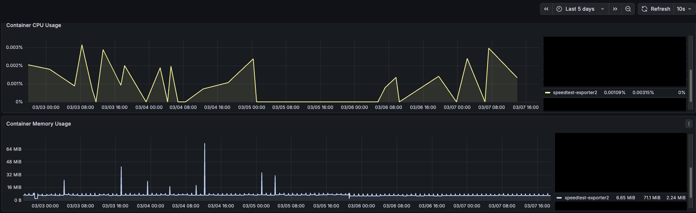

# Speedtest Exporter

<p align="center">
  
  
  <br>
</p>
<p align="center">A Prometheus exporter for monitoring internet speed with <a href="https://speedtest.net">speedtest.net</a>.</p>

<p align="center">
  <a href="https://github.com/veerendra2/speedtest_exporter/actions/workflows/ci.yml"></a>
  <a href="https://github.com/veerendra2/speedtest_exporter/actions/workflows/release.yml"></a>
  <a href="https://github.com/veerendra2/speedtest_exporter/releases/latest"></a>
  <a href="https://github.com/veerendra2/speedtest_exporter/blob/main/LICENSE"></a>
  <a href="https://github.com/veerendra2/speedtest_exporter/stargazers"></a>
  <a href="https://github.com/veerendra2/speedtest_exporter/network/members"></a>
  <a href="https://ghcr.io/veerendra2/speedtest_exporter"></a>
</p>

## Features

- Measures download/upload speeds and latency
- Exports metrics in Prometheus format
- Supports specific speedtest.net server selection (uses [speedtest.net API](https://www.speedtest.net/api/js/servers) via [speedtest-go](https://github.com/showwin/speedtest-go.git))
- Auto-selects nearest server when not specified or if requested server is unavailable
- Includes geographical metadata (user/server location)

## Deployment

### Usage

```bash
Usage: speedtest_exporter [flags]

A Prometheus exporter for monitoring internet speed with speedtest.net

Flags:
  -h, --help                    Show context-sensitive help.
      --address=":8080"         The address where the server should listen on ($ADDRESS).
      --server-id=0             Speedtest.net server ID (0 = auto-select nearest server) ($SERVER_ID)
      --max-connections=4       Number of parallel TCP streams for bandwidth test ($MAX_CONNECTIONS)
      --log-format="console"    Set the output format of the logs. Must be "console" or "json" ($LOG_FORMAT).
      --log-level=INFO          Set the log level. Must be "DEBUG", "INFO", "WARN" or "ERROR" ($LOG_LEVEL).
      --log-add-source          Whether to add source file and line number to log records ($LOG_ADD_SOURCE).
      --version                 Print version information and exit
```

### Using Docker

> Uses distroless base image (`gcr.io/distroless/static:nonroot`) for minimal attack surface and smaller image size. Multi-arch support for `linux/amd64` and `linux/arm64`.

```bash
docker run -d -p 8080:8080 ghcr.io/veerendra2/speedtest_exporter:latest
```

#### Docker Compose

```yaml
---
name: speedtest_exporter
services:
  speedtest_exporter:
    image: ghcr.io/veerendra2/speedtest_exporter:latest
    container_name: speedtest_exporter
    ports:
      - "8080:8080"
    restart: unless-stopped
    hostname: speedtest_exporter
```

## Exported Metrics

```text
# HELP speedtest_download_speed_bps Download speed in bits per second.
# TYPE speedtest_download_speed_bps gauge
speedtest_download_speed_bps 2.64761758619317e+08

# HELP speedtest_latency_seconds Network latency to the speedtest server in seconds.
# TYPE speedtest_latency_seconds gauge
speedtest_latency_seconds 0.028449016

# HELP speedtest_scrape_duration_seconds Total time taken to complete the speedtest.
# TYPE speedtest_scrape_duration_seconds gauge
speedtest_scrape_duration_seconds 23.171728333

# HELP speedtest_status Whether the speedtest was successful (-1 = partial success, 0 = failure, 1 = success).
# TYPE speedtest_status gauge
speedtest_status{distance="121.286353",server_country="Germany",server_id="17982",server_lat="51.9066",server_lon="12.5416",server_name="osts-01.wittenberg-net.de.prod.hosts.ooklaserver.net:8080",user_ip="[REDACTED]",user_isp="Vodafone Germany",user_lat="REDACTED",user_lon="REDACTED"} 1

# HELP speedtest_upload_speed_bps Upload speed in bits per second.
# TYPE speedtest_upload_speed_bps gauge
speedtest_upload_speed_bps 5.175917158818312e+07
```

## Grafana Dashboard

Pre-built Grafana dashboards are available for both VictoriaMetrics and Prometheus data sources:

| Data Source Type | Dashboard JSON                                                                    |
| ---------------- | --------------------------------------------------------------------------------- |
| Prometheus       | [speedtest-exporter-prometheus.json](./assets/speedtest-exporter-prometheus.json) |


## Prometheus Configuration

```yaml
scrape_configs:
  - job_name: "speedtest"
    scrape_interval: 1h
    scrape_timeout: 2m
    static_configs:
      - targets: ["speedtest_exporter:8080"]
```

### Using Query Parameters for Server Selection

Override the server ID on a per-scrape basis by adding `params` to the scrape config:

```yaml
scrape_configs:
  - job_name: "speedtest"
    scrape_interval: 1h
    scrape_timeout: 2m
    params:
      server_id: ["1234"] # Override SERVER_ID env var for this job
    static_configs:
      - targets: ["speedtest_exporter:8080"]
```

**Note:** Query parameter `server_id` takes precedence over the `SERVER_ID` environment variable. If the specified server is unavailable, the exporter automatically selects the nearest server.

## Resource Efficiency

Minimal CPU and memory footprint. The screenshot below shows 5 days of data (Docker, hourly scrapes):



## Development

### Build & Test

#### Using Taskfile

_Install Taskfile: [Installation Guide](https://taskfile.dev/docs/installation)_

```bash
# Available tasks
task --list
task: Available tasks for this project:
* all:                   Run comprehensive checks: format, lint, security and test
* build:                 Build the application binary for the current platform
* build-docker:          Build Docker image
* build-platforms:       Build the application binaries for multiple platforms and architectures
* fmt:                   Formats all Go source files
* install:               Install required tools and dependencies
* lint:                  Run static analysis and code linting using golangci-lint
* run:                   Runs the main application
* security:              Run security vulnerability scan
* test:                  Runs all tests in the project      (aliases: tests)
* vet:                   Examines Go source code and reports suspicious constructs
```

#### Using GoReleaser

_Install GoReleaser: [Installation Guide](https://goreleaser.com/install/)_

```bash
# Build locally
goreleaser release --snapshot --clean
...
```

#### Dev Compose Stack

```bash
docker compose -f compose-dev.yml up --build --force-recreate -d
```

---

> _Inspired by [danopstech/speedtest_exporter](https://github.com/danopstech/speedtest_exporter) which is no longer actively maintained._
